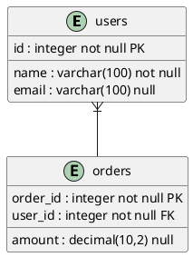

# Database to PlantUML Schema Exporter
## ⚠️ Currently, PostgreSQL, but more databases will come...

This project provides a Python script that extracts the schema of a PostgreSQL database and generates a [PlantUML](https://plantuml.com/) diagram of the database structure. The output diagram includes tables, columns, primary keys, foreign keys, and their relationships, visualized in a simple yet elegant format.

## Features

- Automatically fetches tables, columns, and relationships from a PostgreSQL database.
- Identifies and marks primary keys (PK) and foreign keys (FK) in the output.
- Excludes specified tables from the output diagram.
- Outputs a fully customizable PlantUML file ready for rendering into a visual diagram.

---

## What is PlantUML?

[PlantUML](https://plantuml.com/) is a powerful open-source tool that allows developers to create UML diagrams and other visual representations of system components using a plain text language. It simplifies the process of visualizing system architecture, relationships, and workflows.

### Example Use Cases of PlantUML:
- Visualizing database schemas.
- Documenting software architecture.
- Modeling workflows or processes.

To render a PlantUML diagram, you can use:
- [PlantUML Online Editor](https://plantuml.com/plantuml-editor)
- IDE Plugins (e.g., Visual Studio Code, IntelliJ IDEA)
- Standalone PlantUML JAR file.

---

## Prerequisites

1. **Python 3.7 or higher**
2. **PostgreSQL Database**
3. **Required Python Packages**:
   - `psycopg2`: For connecting to PostgreSQL databases.
   - `configparser`: For handling configuration files.

## Usage
1. Clone the Repository
```bash
git clone https://github.com/aminmesbahi/db-diagram-extractor.git
cd db-diagram-extractor
```

Install dependencies using:
```bash
pip install -r requirements.txt
```

2. Configure the Project
a. config.ini
This file defines your database connection details and output settings. Example:

```ini
[DATABASE]
DBName = your_database_name
User = your_username
Password = your_password
Host = 127.0.0.1
Port = 5432
Schema = public

[OUTPUT]
OutputFile = output.puml
```

b. exclude.ini
Specify tables to exclude from the diagram. Example:

```ini
[EXCLUDE]
tables = table1,table2
```

3. Run the Script
```bash
python main.py
```
The script will generate a output.puml file in the project directory.

Example Output
Here’s an example of a generated PlantUML snippet:


You can visualize this diagram using a PlantUML renderer.

Customization
Styling
The script uses Bootstrap-inspired styling for the diagrams:
```
Background color: #f8f9fa
Border color: #0d6efd
Font: Arial, 14px.
```
You can modify these settings in the to_plantuml() function to match your preferences.

### Excluded Tables
To exclude tables from the output, add their names to the exclude.ini file.

## Contribution
Contributions are welcome!

## Support
If you encounter any issues or have questions, please open an issue in the repository.

**Happy diagramming!**